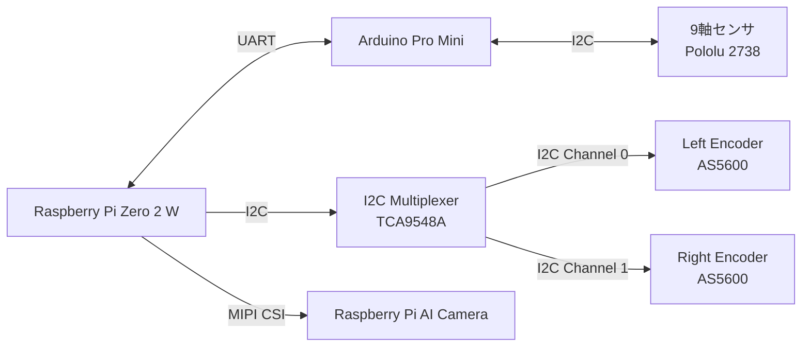

# 1. Interface Overview

# 2. Interface List

|ID|Device A|Device B|Interface|Direction|
|---|---|---|---|---|
|IF-001|RaspberryPiZero2W|ArduinoProMini|UART|Bidirectional|
|IF-002|ArduinoProMini|Pololu-2738|I2C|Bidirectional|
|IF-003|RaspberryPiZero2W|TCA9548A|I2C|Bidirectional|
|IF-004|TCA9548A(0x70)|AS5600|I2C|Bidirectional|
|TF-005|TCA9548A(0x71)|AS5600|I2C|Bidirectional|
|TF-006|RaspberryPiZero2W|RaspberryPiAICamera|CSI|Bidirectional|