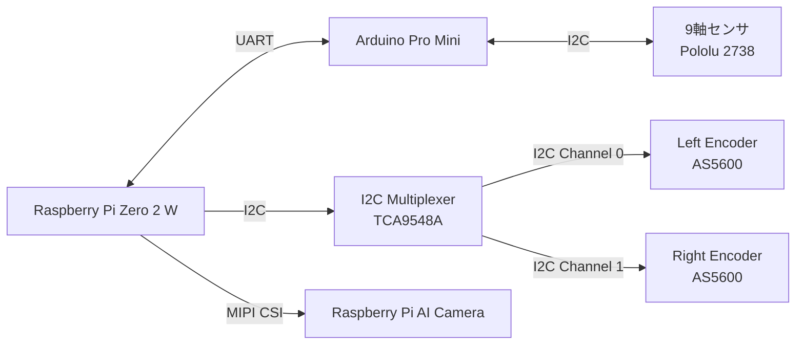

```mermaid
flowchart LR
    RaspberryPi["Raspberry Pi Zero 2 W"]
    Arduino["Arduino Pro Mini"]
    IMU["9軸センサ<br/>Pololu 2738"]
    MUX["I2C Multiplexer<br/>TCA9548A"]
    LeftEncoder["Left Encoder<br/>AS5600"]
    RightEncoder["Right Encoder<br/>AS5600"]
    Camera["Raspberry Pi AI Camera"]

    RaspberryPi <-->|UART| Arduino
    Arduino <-->|I2C| IMU

    RaspberryPi -->|I2C| MUX
    MUX -->|I2C Channel 0| LeftEncoder
    MUX -->|I2C Channel 1| RightEncoder

    RaspberryPi -->|MIPI CSI| Camera
```