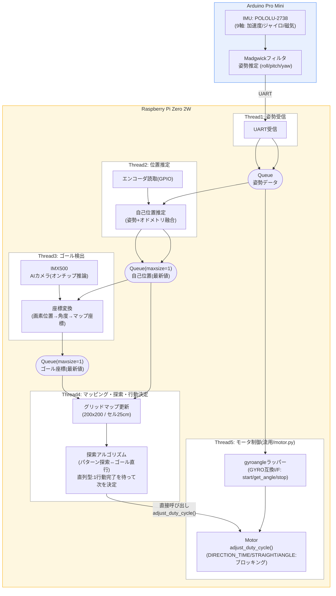

```mermaid
flowchart TB
    subgraph ARDUINO["Arduino Pro Mini"]
        IMU["IMU: POLOLU-2738<br/>(9軸: 加速度/ジャイロ/磁気)"]
        MADGWICK["Madgwickフィルタ<br/>姿勢推定 (roll/pitch/yaw)"]
        IMU --> MADGWICK
    end

    subgraph RPI["Raspberry Pi Zero 2W"]
        direction TB

        subgraph TH1["Thread1: 姿勢受信"]
            UART_RX["UART受信"]
        end

        subgraph TH2["Thread2: 位置推定"]
            ENC["エンコーダ読取(GPIO)"]
            LOC["自己位置推定<br/>(姿勢+オドメトリ融合)"]
            ENC --> LOC
        end

        subgraph TH3["Thread3: ゴール検出"]
            CAM["IMX500<br/>AIカメラ(オンチップ推論)"]
            COORD["座標変換<br/>(画素位置→角度→マップ座標)"]
            CAM --> COORD
        end

        subgraph TH4["Thread4: マッピング・探索・行動決定"]
            MAP["グリッドマップ更新<br/>(200x200 / セル25cm)"]
            EXPLORE["探索アルゴリズム<br/>(パターン探索⇔ゴール直行)<br/>直列型:1行動完了を待って次を決定"]
            MAP --> EXPLORE
        end

        subgraph TH5["Thread5: モータ制御(流用/motor.py)"]
            GYROWRAP["gyroangleラッパー<br/>(GYRO互換I/F: start/get_angle/stop)"]
            MOTOR["Motor<br/>adjust_duty_cycle()<br/>(DIRECTION_TIME/STRAIGHT/ANGLE:ブロッキング)"]
            GYROWRAP --> MOTOR
        end

        Q1(["Queue<br/>姿勢データ"])
        Q2(["Queue(maxsize=1)<br/>自己位置(最新値)"])
        Q3(["Queue(maxsize=1)<br/>ゴール座標(最新値)"])

        UART_RX --> Q1 --> LOC
        UART_RX --> Q1 --> GYROWRAP
        LOC --> Q2 --> MAP
        LOC --> Q2 --> COORD
        COORD --> Q3 --> MAP
        EXPLORE -- "直接呼び出し<br/>adjust_duty_cycle()" --> MOTOR
    end

    MADGWICK -- "UART" --> UART_RX

    style ARDUINO fill:#e8f0fe,stroke:#4285f4
    style RPI fill:#fef7e0,stroke:#f9ab00
    style TH1 fill:#ffffff,stroke:#999
    style TH2 fill:#ffffff,stroke:#999
    style TH3 fill:#ffffff,stroke:#999
    style TH4 fill:#ffffff,stroke:#999
    style TH5 fill:#ffffff,stroke:#999
```